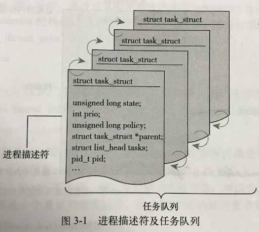

# 《Linux 内核设计与实现》(第三版) 2017年06月27日
作者: Robert Love

## 检视阅读
### 包装
- 书名:
    - 《Linux 内核设计与实现》(第三版)
- 建议上架类别:
    - 计算机/程序设计
- 作者:
    - [Robert Love 罗伯特·拉姆](https://zh.wikipedia.org/wiki/%E7%BE%85%E4%BC%AF%E7%89%B9%C2%B7%E6%8B%89%E5%A7%86)
    - Linux 核心的主要开发者之一, 主要负责抢占式内核、进程调度器、内核事件层、通知机制、VM改进以及设备驱动程序。
        目前在 google 主要负责 Android 移动平台内核的团队成员。
- 作者Level(1-5星):
    - ★★★★
- 策划机构:
    - 华章科技
- 出版社:
    - 机械工业出版社
- 版次或印次:
    - 2015年10月第1版第9次印刷
### 整体
- 目录说了什么(大概说一下结构)
    - 内核简介、源码、进程管理、调度、系统调用、内核数据结构、中断和中断处理、下半部和推后执行的工作、内核同步介绍、内核同步方法、
        定时器和时间管理、内存管理、虚拟文件系统、块I/O层、进程地址空间、页高速缓存和页会写、设备与模块、调试、可移植性、补丁、
        开发和社区
- 本书的目的
    - 让读者对内核各个核心子系统有整体把握: 包括提供什么样的服务, 为什么要提供这样的服务, 以及如何实现的。
    - 还介绍了一些开发时需要的信息: 包括调试技术、编程风格、注意事项等等。
- 本书的目标
    - 提供足够多的关于 Linux 内核设计和实现的信息, 希望读者能够拥有较完备的知识, 可以真正开发内核代码。
- 本书受众群体
    - 核心内核开发者
    - 设备驱动开发者
    - 大学中作为介绍操作系统的辅助教材
- 阅读本书的前提条件
    - 已经掌握了 C 语言, 并且对 Linux 比较熟悉。

### 看细节
- 列举若干关键词: 内核、进程、内核数据结构、中断、下半部、同步、定时器、内存、虚拟文件系统、快I/O层、进程地址空间、页高速缓存、设备与模块、调试、可移植性
- 本书诚意度(1-5星)
    -  ★★★★

### 下判断
- 本书对我当下的价值
    - 了解 linux 系统内部的大概实现。
- 建议在什么时候继续阅读
    - 现在 (√)
    - 越早越好
    - 写入目标
    - 以后再说吧
- 建议采用什么方法阅读
    - 随便翻翻
    - 分析阅读 (√)
    - 主题阅读

### 粗阅读
- 简要书写阅读后的感受, 不超过300字。
- 从第三章开始, 每章都会介绍一个子系统, 但有一件事情需要意识到, 如果没意识到的话, 就会导致: 浪费很多时间, 学习效率不高, 坚持不下去等等情况。(学不会, 没有反馈, 必然坚持不下去。)
- 这件事情是: 阅读源码, 修改源码。而不是急着去看具体的子系统。要用一种抠的精神去学, 不要在意学习速度, 需要在意的是: 是否学会了。
- 原文: 第二章小结, 本章和以前的章节为贯穿本书剩余章节所讨论的主题奠定了基础。在后续的每一章中, 我们都会涵盖内核的一个具体概念或子系统。
在探索的征途中, 最重要的是`阅读和修改内核源码`, 只有通过实际的阅读和实践才会理解内核。

### 学到的理念

#### 系统规模逐渐扩大, 复杂程度不断提高, 内核开发者对内核了解越来越深入, 而新手却无法跟上内核的发展, 长此以往将出现断层。
解决方案:
- 尽量保证代码整洁: 接口定义合理, 代码风格一致, "一次做一件事, 做到完美", Linus Torvalds 的解决办法。

#### 不看源码, 就学不会

### 备注
- [清华大学网络技术研究所课程](http://www.tsinghua.edu.cn/publish/cs/4765/index.html)
    - 计算机组成原理
    - 操作系统
    - 计算机网络
    - 算法分析
    - 离散数学
    - 操作系统专题训练
    - 组合数学
    - 数据安全
    - 宽带网络交换技术


## 带着问题读书

### 画出 Linux 系统结构图
- [Linux 系统结构详解](http://blog.csdn.net/hguisu/article/details/6122513)
各个子系统关系, 实现细节


## 译者序
Linux 的自由精神, 源码唾手可得。。
Linux 内核入门很难: 规模庞大, 层面复杂。
本书可以帮你舍弃细枝末节, 让你对核心子系统有整体把握, 包括它们提供了什么服务, 为什么要提供这样的服务, 以及如何实现。

## 第 1 章 Linux 内核简介
#### Unix 强大的跟本原因:
- Unix 很简洁:
    - Unix 仅有几百个系统调用, 并且有一个非常明确的设计目的。
- 高度抽象:
    - 所有的东西都被当做文件对待。
    - 对数据、对设备的操作都通过一套接口来调用: open()、read()、write()、lseek() 和 close();
- C语言编写:
    - 在硬件体系架构有惊人的移植能力, 并且是广大的开发人员很容易就能接受它。
- 进程创建迅速:
    - 创建迅速, 并且有一个独特的 fork() 系统调用。 `fork() 系统调用是干啥的?`
- 清晰的层次化结构:
    - 简单稳定的进程通信元语。
    - 快速简洁的进程创建策略、简单稳定的进程间通信机制。策略和机制分离的设计理念,保证了清晰的层次化结构。

#### 内核的组成:
- 中断服务程序:
    - 负责响应中断。由硬件设备产生异步的中断信号。
- 调度程序:
    - 负责管理多个进程分享处理器时间。
- 内存管理程序:
    - 管理进程地址空间。
- 系统服务程序:
    - 负责进程间通信。

#### 内核空间 用户空间
应用程序通过系统调用与内核通信。

#### 处理器的活动范围
- 用户空间: 执行用于进程
- 内核空间: 进程上下文, 代表某个特定的进程执行。
- 内核空间: 中断上下文, 与进程无关, 处理特定的中断。

#### Linux 与 Unix 内核的比较
- 单内核 与 多内核的设计比较
    - 单内核:
        - 整体是一个大过程
        - 单独的地址空间, 内核可以直接调用函数。
        - 大多数 Unix 系统都设计为单模块
    - 微内核:
        - 多个独立的过程
        - 各自独立的地址空间
        - 不能像单模块内核那样直接调函数, 通过消息传递处理内核同学。
        - 避免一个服务失效, 影响其他服务。
- Linux 的情况
    - Linux 是一个单内核
    - 吸取了微内核的精华:
        - 模块化设计、抢占式内核、支持内核线程、动态装载内核
        - 为避免微内核的缺陷, 让所有的事情都在内核态运行, 直接调函数, 无需消息传递。
- Linux 与 Unix 内核的比较
    - Linux 支持动态加载内核
    - Linux 支持对称多处理机制
    - Linux 内核可以抢占
    - Linux 不区分线程和其他一般的进程。
    - Linux 提供设备模型、热拔插事件, 用户空间的设备文件系统
    - 态度: 任何改变都必须要通过【简洁的设计】以及【可靠地实现】来解决问题。

#### 小结
- 内核的目标: 为达到目标所进行的设计以及设计的实现。
- 重点: 搞一份内核源码, 研究源码才能更清楚实现原理。
- 本书相当于一份内核源码的结构图, 可以让你拥有上帝视角。

## 第 2 章 从内核出发
本章主要介绍:
- 从何处获取源码: [Linux 内核官方网站](https://www.kernel.org/)
    - 使用 git 获取(书上强烈推荐, 因为下载完成, 可以很方便的更新, 但代码约780M, git下载很慢):
        - `git clone git://git.kernel.org/pub/scm/linux/kernel/git/stable/linux-stable.git`
        - kernel 官网有三种版本:
            - mainline: 主线版本, 最新的
            - stable: 稳定版本
            - longterm: 长期支持版本
    - 从内核官网下载压缩包:
        - 有各种格式的压缩包。
        - 使用补丁更新: `patch -p1 < ../patch-x.y.z` 一个补丁需要打在上一个版本上。
- 如何编译:
- 如何安装新内核:

### 2.1 获取内核源码
- Git 的起源: Git 是 Linus Torvalds 为了帮助管理 Linux 内核开发而开发的一个开放源码的版本控制软件。它是分布式的。
- 内核源码一般放在 `/usr/src/linux` 目录下。不要动这个目录。建立自己的主目录, 用root身份安装新内核。

### 2.2 内核原码树


以下为各个目录的说明, 附上两个参考链接:
- [参考链接:1.3 内核源代码的目录结构](https://github.com/tsuibin/kernelTools/wiki/1.3-%E5%86%85%E6%A0%B8%E6%BA%90%E4%BB%A3%E7%A0%81%E7%9A%84%E7%9B%AE%E5%BD%95%E7%BB%93%E6%9E%84)
- [参考链接:Linux内核源码目录结构说明](http://ykzhai.top/2017/03/13/Linux/%E5%86%85%E6%A0%B8/Linux%E5%86%85%E6%A0%B8%E6%BA%90%E7%A0%81%E7%9B%AE%E5%BD%95%E7%BB%93%E6%9E%84%E8%AF%B4%E6%98%8E/)

#### arch
包含特定硬件体系结构相关的代码, 每个子目录都代表一种Linux支持的体系结构。每个子目录又至少包含3个子目录
- kernel: 存放体系结构特有的诸如信号量处理和SMP之类特征的实现。
- lib: 存放体系结构特有的诸如strlen和memcpy之类的通用函数实现。
- mm: 存放体系结构特有的内存管理程序的实现。
除了这3个子目录之外，大多数体系结构在必要的情况下还有一个boot子目录，包含了在这种硬件平台上启动内核所使用的部分或全部平台特有代码。
此外，大部分体系结构所特有的子目录还根据需要包含了供附加特性使用的其他子目录。比如，i386目录包含一个math-emu子目录，其中包括了在缺少数学协处理器（FPU）的CPU上运行模拟FPU的代码。

#### block
块设备驱动程序。I/O调度块设备驱动包括IDE（在ide.c中）驱动。块设备是以数据块方式接收和发送的数据的设备。

#### crypto
常用加密和散列算法(如:AES, SHA等), 还有一些压缩和 CRC 校验算法。

#### Documentation
内核相关文档

#### drivers
设备驱动程序，每个不同的驱动占用一个子目录。(由操作系统调用, 为软件服务。 firmware为硬件服务)

#### firmware (固件)
应用 --> 驱动 --> 固件 --> 硬件逻辑。
固件是为了操作硬件的, 留有接口让驱动来调用, 一般都是直接烧在硬件上。

fireware中包含了让计算机读取和理解从设备发来的信号的代码, ，举例来说，一个摄像头管理它自己的硬件，但计算机必须了解摄像头给计算机发送的
信号。Linux系统会使用vicam固件（firmware）来理解摄像头的通讯。否则，没有了固件，Linux系统将不知道如何处理摄像头发来的信息。另外，固
件同样有助于将Linux系统发送消息给该设备。这样Linux系统可以告诉摄像头重新调整或关闭摄像头。

#### fs
各种支持的文件系统, 如:ext、fat、ntfs等。

#### include
这个目录包含了内核中大部分的头文件，它按照下面的子目录进行分组。要修改处理器结构则只需编辑核心的makefile并重新运行Linux核心配置程序。
include/asm-*/ 每一个对应着一个arch的子目录，比如include/asm-alpha、Include/asm-arm等。每个子目录中的文件都定义了支持给定体系结构所必要的预处理函数和内联函数，这些内联函数多数都是全部或者部分的汇编语言实现。
include/linux 与平台无关的头文件都在这个目录下，它通常会被链接到目录/usr/include/linux(或者它里面的所有文件都会被复制到/usrinclude/linux目录下边)

#### init
内核的初始化代码。包括main.c、创建早起用户空间的代码及其他初始化代码。（注意不是系统引导代码）。

#### ipc
进程间通信(Inter Process Communication)，它包含了共享内存、信号量及其他形式的IPC代码。

#### kernel
内核中最核心的部分，包括进程的调度（sched.c）,以及进程的创建和撤销（fork.c和exit.c）和平台相关的另外一部分核心代码在arch/*/kernel目录下。

#### lib
此目录包含了核心的库代码。实现了一个标准C库的通用子集，包括字符串和内存操作的函数（strlen、mmcpy等）以及有关sprintf和atoi系列函数。
与arch/lib下的代码不同，这里的库代码都是C编写的，在内核新的移植版本中可以直接使用。与处理器结构相关库代码被放在arch/*/lib中。

#### mm
此目录包含了与体系无关的部分内存管理代码。与体系结构相关的内存管理代码位于arch/*/mm下

#### net
核心的网络部分代码，实现了各种常见的网络协议，入TCP/IP、IPX等

#### samples
一些内核编程的范例

#### scripts
用于配置内核文件的脚本文件。当运行make menuconfig或者make xconfig之类的命令配置内核时，用户就是和位于这个目录下的脚本进行交互的。

#### security
这个目录下包含了不同的Linux安全模型的代码。它对计算机免于受到病毒和黑客的侵害很重要。否则，Linux系统可能会遭到损坏。(主要是一个SELinux的模块)

#### sound
声卡驱动以及其他声音相关的源码(常用音频设备的驱动程序等)

#### tools
这个文件夹中包含了和内核交互的工具。

#### usr
实现用于打包和压缩的cpio等。这个文件夹中的代码在内核编译完成后创建这些文件。

#### virt
此文件夹包含了虚拟化代码，它允许用户一次运行多个操作系统。通过虚拟化，客户机操作系统就像任何其他运行在Linux主机的应用程序一样运行。

#### 其他
- COPYING: 文件是内核许可证(GNU GPL v2)
- CREDITS: 是内核代码的开发者列表。
- MAINTAINERS: 是维护者列表, 负责维护内核子系统和驱动程序
- Makefile: 是基本内核的 Makefile, 描述整个工程所有文件的编译顺序、编译规则。 make 是一个命令工具, 用来解释 Makefile 中的指令(规则)

### 2.3 内核编译
[参考链接:1.2 Linux内核的配置、编译与安装](https://github.com/tsuibin/kernelTools/wiki/1.2-Linux%E5%86%85%E6%A0%B8%E7%9A%84%E9%85%8D%E7%BD%AE%E3%80%81%E7%BC%96%E8%AF%91%E4%B8%8E%E5%AE%89%E8%A3%85)

#### Linux 在编译前, 可以修改配置。

- make config: 遍历所有配置项, 让你选 yes、no或 module。
- make defconfig: 基于默认配置为你的体系结构创建一个配置。
- make: 内核配置ok, 就可以用此命令进行编译了。

#### 减少编译的垃圾信息
```
尽量减少垃圾信息, 又能看到错误和警告
make > .. /detritus

扔掉所有信息
make > /dev/null
```

#### 衍生多个编译作业
可以使用类似多线程的方式并发编译, 可以加快编译速度。 默认情况 make 只衍生一个作业, 防止多个依赖互相冲突。但内核 Makefile 不会有这样的编码错误, 所以可以用此方法。

```
n 是要衍生出作业数量。
make -jn

16核的机器可以用如下指令:
make -j32 > /dev/null
```

#### 2.3.4 安装新内核
编译完成后, 需要安装, 与体系结构和启动引导工具(boot loader)相关。

`make modules_install` 可以把编译好的模块安装到正确的主目录 /lib/modules 下。
编译时会在内核根目录下创建 System.map 文件, 这是一份符号对照表。将内核符号与他们的起始地址对应起来。

### 2.4 内核开发的特点
- 内核编程时既不能访问 C 库, 也不能访问标准的 C 头文件
    - 2.4.1 无 libc 库抑或无标准头文件
        - 对内核来说, 完整的C库 -- 哪怕是一个子集, 都太大且太低效了。
        - 头文件位于顶级目录 include 目录中。`<linux/inotify.h>` 位于 `include/linux/inotify.h`
        - 体系结构相关的头文件位于 `arch/<architecture>/include/asm` 目录下。
- 内核编程时必须使用 GNU C
    - 原因在于内核开者总要用到 gcc 提供的许多语言扩展部分。
        - 内联函数: 编译时在调用位置插入内敛函数对应的代码。可消除函数调用和返回带来的开销。但代码会变长。一般吧对时间要求较高, 长度较短的函数定义为内联函数。
        - 内联汇编: 对执行时间要求严格的地方, 一般使用汇编语言。 其他大部分是 C 语言。
        - 分支声明: 对于条件选择语句, GCC 内建了一条指令用于优化, 如: likely() 和 unlikely()
- 内核编程时缺乏像用户控件那样的内存保护机制
- 内核编程时难以执行浮点运算
- 内核编程时每个进程只有一个很小的定长堆栈
    - 用户空间的栈本身比较大, 还能动态增长
    - 内核栈的准确大小随着体系结构变化, 32位机的内核站是8KB, 64位机是 16KB。
- 内核编程时支持异步中断、抢占和 SMP, 因此必须时刻注意同步和并发
    - 内核很容易产生竞争条件, 原因在于:
        - Linux 是抢占多任务操作系统
        - Linux 内核支持对称多处理器系统: 两个以上的处理器执行内核代码和可能同时访问共享的同一个资源。
        - 中断是异步到来的, 完全不顾及当前正在执行的代码。
        - Linux 内核可以抢占。
    - 常用的解决竞争的办法是`自旋锁`和`信号量`。
- 要考虑可移植性的重要性
    - 需要把与体系结构相关的代码从内核代码树的特定目录中适当的分离出来。

### 2.5 小结
最重要的是阅读和修改内核源码, 只有通过实际的阅读和实践才会理解内核。

## 第3章 进程管理
进程是操作系统抽象概念最基本的一种。操作系统就是为了运行用户程序, 因此进程管理就是所有操作系统的心脏。
本章讨论 Linux 内核如何管理每个进程: 如何列举、创建、消亡。

[Linux下的进程1——进程概念，进程切换，上下文切换，虚拟地址空间](http://blog.csdn.net/lixungogogo/article/details/52202714)

### 3.1 进程(task)
- 进程: 处于执行期的程序以及相关资源的总称。(打开的文件, 挂起的信号, 内核内部数据)
- 线程: 在进程中活动的对象, 每个线程都拥有:
    - 独立的程序计数器:
        - 较小的内存空间, 可以简单理解为当前线程执行到哪一行了。多线程切换恢复、分支、循环、跳转、异常处理等基础功能都依赖这个计数器来完成。
    - 进程栈:
        - 存放参数值, 局部空间变量。
    - 一组进程寄存器:
        - 进程切换时, 会挂起当前进程, 此时需要将CPU寄存器中的数据存储起来(所有进程共享CPU寄存器), 进程切换只发生在内核态, 用户态进程寄存器的内容存放在内核态的堆栈上。
- 进程提供两种虚拟机制:
    - 虚拟处理器: 感觉像在独享处理器, 屏蔽其他进程的干扰?(第四章介绍)
    - 虚拟内存: 感觉像独立拥有整个内存资源。

系统调用:
- fork(): 创建子进程, 再返回时, 父进程回复执行, 子进程开始执行。由 clone() 系统调用实现。
- exec(): 创建新的地址空间, 并把新的程序载入。
- exit(): 推出执行, 会终结进程, 并将其占用的资源释放掉。 进程推出后, 被设置为僵死状态, 直到父进程调用 wait();

### 3.2 进程描述符及任务结构
内核把进程列表存放在【任务队列】(task list)的双向循环链表中。链表每一项都是 task_struct. 结构定义在 `include/linux/sched.h` 中。32位机器中占1.7KB。
task_struct (进程描述符): 包含一个内存管理一个进程所需的所有信息。task_struct 包含的数据能完整的描述一个正在执行的程序:
- 打开的文件
- 进程的地址空间: 虚拟地址空间, 它通过页表(Page Table)映射到物理内存。
- 挂起的信号
- 进程的状态
- 其他更多信息。



#### 3.2.1 分配 task_struct (进程描述符)
Linux 通过 slab 分配器分配 task_struct 结构, 能达到对象服用和缓存着色。(可以避免动态分配和释放所带来的资源消耗)
slab 生成的 task_struct 存放在: 进程内核栈的栈底(向下增长的栈)的 thread_info 结构中, 该结构有一个指向 task_struct 的指针。

#### 3.2.2 task_struct 的存放
##### task_struct 的唯一标识:
内核通过唯一的进程标识或PID 来标识每个进程。PID 存放在进程自己的 task_struct 里面。
PID 默认最大值为 32768(short int 的最大值, 为了和老版本的 Unix 和 Linux 兼容), 受 `<linux/threads.h>` PID_MAX_DEFAULT 控制。
>源码: `#define PID_MAX_DEFAULT (CONFIG_BASE_SMALL ? 0x1000 : 0x8000)`  即: 4096 或 32768

##### 操作系统进程的最大数量
PID 最大值实际就是系统中允许同时存在的`进程的最大数量`。可以修改 `/proc/sys/kernel/pid_max` 来提高上限。

##### 如何获取到 task_struct
内核访问 task_struct 非常频繁。如何快速拿到 task_struct 指针很重要:
- 有的硬件体系结构拿出`专门的寄存器`存放指向当前进程的 task_struct。
- 像 x86 这种体系结构(寄存器不富裕), 在内核站尾端创建 thread_info 结构, 通过计算偏移间接查找 task_struct。
>源码: `current_thread_info()->task;`

#### 3.2.3 进程状态
`task_struct->state` 域描述了进程的当前状态, 系统中的每个进程必然处于五中状态的一种:
- TASK_RUNNING(运行): 可执行或正在执行。
- TASK_INTERRUPTIBLE(可中断): 被阻塞的线程, 或等待某些条件达成, 一旦条件满足, 内核就会把状态设置为 RUNNINT。
- TASK_UNINTERRUPTIBLE(不可中断): 收到信号也不会被唤醒。
- _TASK_TRACED: 被其他线程跟踪、监视, 比如打断点调试。
- _TASK_STOPPED(停止): 停止执行, 好几个信号可以达到此目的。此外调试期间也会让进程进入此状态。


#### 3.2.4 设置当前进程状态
>源码:`set_task_state(task, state);` 将任务的task 状态设置为 state
`<linux/sched.h>` 中有这些相关函数

#### 3.2.5 进程上下文
程序代码载入到进程的地址空间执行, 开始是在用户空间执行。 发生`系统调用`或`触发某个异常`, 就会进入内核空间。此时内核处于进程上下文中。current 宏有效。
对内核的访问, 必须通过接口进行。如: `系统调用` 或 `异常处理`。

#### 3.2.6 进程家族树
- Unix、Linux 进程之间存在明显的继承关系。 所有的进程都是 POI 为 1 的 init 进程的后代。内核在系统启动的最后阶段启动 init 进程, 该进程读取系统的初始化脚本执行其他 的相关程序。最终完成系统启动。
- 如何获取其他进程: `task_struct->parent` 可以拿到父进程。`task_struct->children` 子进程是双向循环列表。通过这种体系, 可以从任何一个进程出发找到任意指定的其他进程。
- [关于 list_head 结构体, 参见这篇 wiki](http://blog.csdn.net/u013904227/article/details/50931540)

### 3.3 进程创建
其他系统创建进程的流程:
1.新的地址空间创建进程
2.读入可执行文件
3.开始执行

Unix 把上面的步骤分为两步实现, fork() 和 exec():
- fork(): 拷贝当前进程创建子进程。 子进程与父进程的区别仅在于: PID、PPID(父进程PID)、某些资源和统计量(如: 挂起的信号)。
- exec(): 读取可执行文件, 并载入地址空间开始运行。

#### 3.3.1 写时拷贝
调用 fork() 时, 先让父子进程共享同一个拷贝, 只有需要写入时, 数据才会被复制。地址空间上的页的拷贝被推迟到写入时才进行。如果不写入, 就不进行拷贝了。
一般情况下, 进程创建后就会马上运行一个可执行的文件。这种优化可以避免拷贝大量根本就不会用的数据。(地址空间里常常包含数十兆的数据)

#### 3.3.2 fork()
Linux 通过 clone() 来实现 fork(), 这个调用通过一系列的参数标志来指明父、子进程需要共享的资源。clone() 会调用 do_fork(), do_fork()完成创建大部分工作, 定义在 `kernel/fork.c`
- dup_task_struct() 为新进程创建一个内核栈、 thread_info 结构和 task_struct。这些值与父进程相同。
- 当前用户的进程数, 没超过给它分配的资源数。
- 初始化子进程, 与父进程分开。
- 子进程的状态被设置为 TASK_UNINTERRUPTIBLE, 保证不会被投入运行。`问题: 该进程此时已经注册到任务队列中了? 如果注入进去了, 调度到这个进程了如何处理?`
- copy_process() 调用 copy_flags() 更新 task_struct 的 flags 成员。PF_SUPERPRIV(超级用户权限) = 0, PF_FORKNOEXEC(没调用 exec 函数)
- alloc_pid() 为新进程分配一个有效的 PID
- 根据传给 clone() 的参数标志, copy_process() 拷贝或共享打开的文件、文件系统信息、信号处理函数、进程地址空间和命名空间等。
- 最后, copy_process() 做扫尾工作, 并返回一个指向子进程的指针。
回到 do_fork 函数, 如果 copy_process() 函数成哥返回, 子进程被唤醒, 并投入运行。内核一般会让子进程首先执行, 一般子进程都会直接调用 exec(), 可以避免写时拷贝的额外开销, 如果父进程首先执行, 则有可能向地址空间写入。

#### 3.3.3 vfork()
参见 3.4.1 进程创建。

#### 3.3.4 我的理解&总结
Linux 的用户进程不能直接被创建出来, 因为不存在这样的API。它只能从某个进程中复制出来, 再通过 exec 这样的API来切换到实际要运行的程序文件。
- 复制的API有三种: fork、clone、vfork。
这三个API实际都调用了内核内部函数 do_fork, 只是填的参数不同而已。
- fork: 是进程资源的完全复制, 包括: 进程的PCB、线程的系统栈、进程的用户空间(相对庞大)、进程打开的设备等。
- clone: 前两项是复制了, 后两项与父进程共享。
- vfork: fork 的部分过程, 用以简化并提高效率。与父进程共享数据段, 子进程将优先于父进程执行。

##### fork 与 vfork 的差别:
- fork 是创建一个子进程, 并把父进程的内存数据 copy 到子进程中。
- vfork 是创建一个子进程, 并发父进程的内存数据 share 一起用。
差别是: 一个是 copy, 一个是 share。

##### 为啥要有 vfork?
起初只有fork，但是很多程序在fork一个子进程后就exec一个外部程序，于是fork需要copy父进程的数据这个动作就变得毫无意了，而且这样干还很重（注：后来，fork做了优化，详见本文后面），所以，BSD搞出了个父子进程共享的 vfork，这样成本比较低。因此，vfork本就是为了exec而生。

##### fork 太重, vfork 又太危险, 所有就有了 写时复制(COW)
对于fork后并不是马上拷贝内存，而是只有你在需要改变的时候，才会从父进程中拷贝到子进程中，这样fork后立马执行exec的成本就非常小了。所以，Linux的Man Page中并不鼓励使用vfork()。
于是，从BSD4.4开始，他们让vfork和fork变成一样的了
写时复制: fork 执行时并不真正复制用户控件所有页面, 只复制页面表。无论父进程还是子进程, 当发生用户空间的写操作时, 会引发"写复制", 另行分配一块可用的用户空间。
上面的话摘录与: 参考链接 -- [酷壳 -- VFORK 挂掉的一个问题](http://coolshell.cn/articles/12103.html)

##### 参考链接:
- [Linux中fork，vfork和clone详解（区别与联系）](http://blog.csdn.net/gatieme/article/details/51417488)
- [酷壳 -- VFORK 挂掉的一个问题](http://coolshell.cn/articles/12103.html)
- [linux下的 fork vfork和clone函数](http://blog.csdn.net/kennyrose/article/details/7532912)

### 3.4 线程在 Linux 中的实现
- Linux 把所有的线程都当做进程来实现。线程仅仅被视为一个与其他进程共享某些资源的进程。
- 每个线程都有唯一隶属于自己的 task_struct。,所以在内核中, 它看起来就像是一个普通的进程。

#### 3.4.1 创建线程
- clone 传入不同的参数, 不同的结果
    - 线程创建:
        - `clone(CLONE_VM | CLONE_FS | CLONE_FLES | CLONE_SIGHAND, 0);`
    - 普通的 fork() :
        - `clone(SIGCHLD, 0);`
    - vfork():
        - `clone(CLONE_VFORK | CLONE_VM | SIGHAND, 0);`
- 参数含义:
    - CLONE_VM: 父子进程共享地址空间。
    - CLONE_FS: 父子进程共享文件系统信息
    - CLONE_FILES: 父子进程共享打开的文件
    - CLONE_SIGHAND: 父子进程共享信号处理函数及被阻断的信号。
    - CLONE_VFORK: 调用 vfork(), 所以父进程准备睡眠等待子进程将其唤醒。

#### 3.4.2 内核线程
- 简单的介绍了下内核线程, 它与普通进程的区别在于: 内核线程没有独立的地址空间, 指向地址空间的 mm 指针被设置为 NULL。
- 内核是通过 【kthreadd 内核进程】衍生出所有的新的内核线程来自动处理。`<linux/kthread.h>` 有接口:
    - *kthread_create()
    - *kthread_run()

### 3.5 进程终结
>当进程终结的时候, 内核必须释放它所占有的资源, 并把这一事件告知其父进程。调用 do_exit后, 子进程进入僵尸状态, 保留一定的信息(进程id, 退出状态, 运行时间等), 等待父进程调用 wait/waitpid 时才释放。
>为什么子进程要进入僵尸状态? 父进程可能需要取得子进程的退出状态等信息。

- 进程终结有两种原因:
    - 主动终结: 自身调用 exit() 主动退出
    - 被动终结: 如发生异常时

- 不管进程如何终结, 该任务的大部分都要靠 do_exit() `<kernel/exit.c>`来完成, 它有如下工作:
    - 将 task_struct 中的标志成员设置为 PF_EXITING。
    - 调用 del_timer_sync() 删除任一内核定时器。它确保没有定时器在排队, 也没有定时器处理程序在运行。
    - 如果 BSD 的进程记账功能是开启的, do_exit() 调用 acct_update_integrals() 来输出记账信息。
    - 然后调用 exit_mm() 函数释放进程占用的 mm_struct, 如果没有别的进程使用它们(地址空间没被共享), 就彻底释放。
    - 调用 sem_exit() 函数, 如果进程排队等候 IPC 信号, 它则离开队列。
    - 调用 exit_files() 和 eixt_fs(), 分别递减文件描述符、文件系统数据的引用计数。如果值为0, 那么就代表没有进程在使用, 可彻底释放。
    - 接着 task_struct() 的 exit_code 成员中的任务退出代码置为由 exit() 踢动的退出代码。或者去完成其他内核机制规定的退出动作。退出代码存放在这供父进程随时检索。
    - 调用 exit_notify() 向父进程发送信号, 给子进程寻找养父, 养父为线程卒中的其他线程或者为 init 进程, 并把进程状态(task_struct--> exit_state) 设置成 EXIT_ZOMBLE。
    - do_exit() 调用 schedule() 切换到新的进程。因为处于 EXIT_ZOMBLE 状态的进程不会灾备调度, 所以这是进程所执行的最后一段代码。 do_exit() 永不返回。
    - 此时:
        - 进程相关的资源都被释放(共享的资源例外)。
        - 处于退出状态: exit_zombie.
        - 当前占用的内存: 内核栈、thread_info 结构和 task_struct 结构。
        - 进程存在的【唯一目的】: 向它的父进程提供信息。父进程检索到信息后, 或者通知内核那是无关的信息后, 由进程所持有的剩余内存被释放, 归还给系统使用。

#### 3.5.1 删除进程描述符
>本节主要介绍如何干掉已经终结进程的 task_struct。
在调用 do_exit()后, 尽管线程已经僵死, 但系统还保留了 task_struct, 目的是为让系统有办法在子进程终结后仍能获得他的信息。
- release_task() 的工作:
    - 它调用__exit_signal(), 该函数调用_unhash_process(), 后者又调用detach_pid()从pidhash上删除该进程，同时也要从任务列表中删除该进程。
    - _exit_signal()释放目前僵死进程所使用的所有剩余资源，并进行最终统计和记录。
    - 如果这个进程是线程组最后一个进程，并且领头进程已经死掉，那么release_task()就要通知僵死的领头进程的父进程。
    - release_task()调用put_task_struct()释放进程内核栈和thread_info结构所占的页，并释放tast_struct所占的slab高速缓存。
    - 至此，进程描述符和所有进程独享的资源就全部释放掉了

#### 3.5.2 孤儿进程造成的进退维谷
> 如果父进程在子进程之前推出, 必须有机质来保证子进程能找到一个新的父亲, 否则子进程就会在退出时永远处于僵死状态, 白白浪费内存。
解决方法: 给子进程在当前线程组内找一个线程做父亲, 如果不行, 就让 init 做他们的父进程。

### 3.6 小结
本章介绍了操作系统的核心概念 —— 进程。也讨论了如下细节:
- 进程的一般特性:
- 进程与线城之间的关系:
- Linux 如何存放和表示进程: task_struct 和 thread_info
- 如何创建进程: fork(), 实际最终是 clone()
- 如何执行: exec() 系统调用族
- 父进程如何收集后代信息: wait()
- 如何消亡: exit() 或 发生异常被强制干掉。
> 进程是一个非常基础、非常关键的抽象概念, 位于每一种现代操作系统的核心位置, 是我们拥有操作系统的最终原因。
